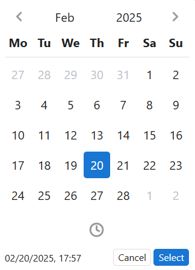
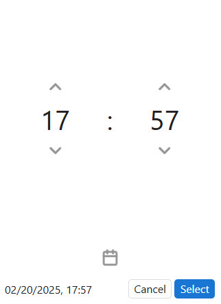
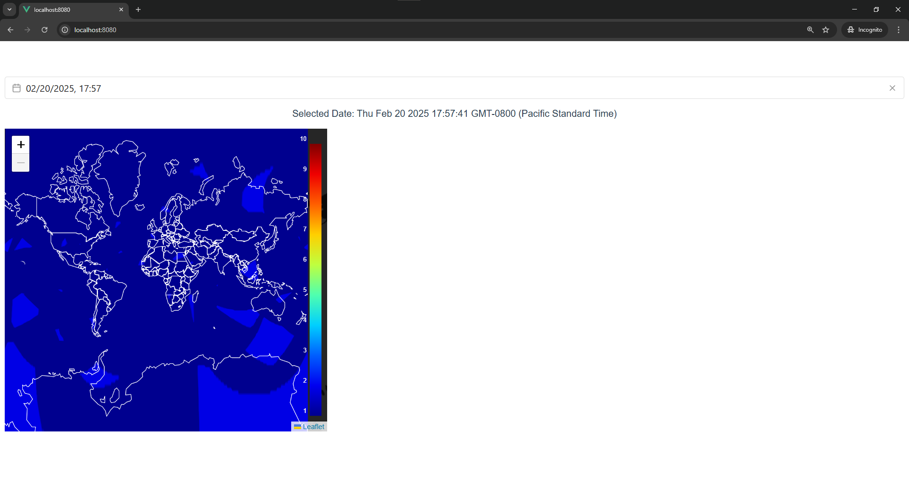

<a id="readme-top"></a>
<br />
<div align="center">
<h3 align="center">vue-dop-visualizer</h3>

  <p align="center">
    A Vue.js frontend application for visualizing GPS performance using Dilution of Precision (DOP). This application displays a world map with DOP data overlaid as contour plots, providing insights into satellite positioning accuracy.
    <br />
    
  </p>
</div>

<!-- TABLE OF CONTENTS -->
<details>
  <summary>Table of Contents</summary>
  <ol>
    <li>
      <a href="#about-the-project">About The Project</a>
      <ul>
        <li><a href="#built-with">Built With</a></li>
      </ul>
    </li>
    <li>
      <a href="#getting-started">Getting Started</a>
      <ul>
        <li><a href="#prerequisites">Prerequisites</a></li>
        <li><a href="#installation">Installation</a></li>
        <li><a href="#dependencies">Dependencies</a></li>
        <li><a href="#devdependencies">Dev Dependencies</a></li>
      </ul>
    </li>
    <li><a href="#usage">Usage</a></li>
    <li><a href="#roadmap">Roadmap</a></li>
    <li><a href="#acknowledgments">Acknowledgments</a></li>
  </ol>
</details>

## About The Project
### Contributions by Zhuowen Li
I was part of the frontend team, where I contributed to:
- **Visualizing DOP data on the world map** using **Leaflet.js**.
- **Implementing interactive features** for exploring GPS performance data.
- **Enhancing the UI and optimizing performance** for large-scale geospatial datasets.
### Built With
* [![Vue][Vue.js]][Vue-url]
* [](https://leafletjs.com/)

<p align="right">(<a href="#readme-top">back to top</a>)</p>

<!-- GETTING STARTED -->
## Getting Started

### Prerequisites
The following software must be installed on your device to run ```vue-dop-visualizer```.

1. **Node.js** & **npm**:

    - Download & install Node.js version: LTS 20.x (includes npm)
        - [Node.js Download](https://nodejs.org/en/download)
        - [More instructions on Node.js installation](https://docs.npmjs.com/downloading-and-installing-node-js-and-npm)
        - Install Vue CLI to use globally (optional):

            ```
            npm install -g @vue/cli
            vue --version
            ```
    - Verify installation:

        ```
        node -v
        npm -v
        ```
2. Clone the repository from GitHub

    - Choose where you want to clone the repository locally:

        ```
        cd /path/to/your_directory
        ```
    - Clone the repository:

        ```
        git clone https://github.com/zhuowen3/Aerospace-DOP-Visualization.git
        ```
    <p align="right">(<a href="#readme-top">back to top</a>)</p>

### Dependencies
```vue-dop-visualizer``` requires the following **dependencies**:

| Package | Version | Description |
|---------|---------|-------------|
| **Vue.js** | ^3.2.13 | JavaScript frontend framework for building web user interfaces|
| **Leaflet** | ^1.9.4 | Library for interactive maps |
| **Leaflet Contour** | ^1.0.0 | Plugin for rendering contour data on Leaflet maps |
| **Vue DatePicker** | ^11.0.1 | Date picker component for Vue |
| **Proj4** | ^2.15.0 | Library for converting geographic coordinates |
| **Proj4Leaflet** | ^1.0.2 | Proj4 projection support for Leaflet |
<p align="right">(<a href="#readme-top">back to top</a>)</p>

### DevDependencies
```vue-dop-visualizer``` requires the following **development dependencies**:

| Package | Version | Description |
|---------|---------|-------------|
| **@babel/core** | ^7.12.16 | JavaScript compiler for ES6+ support |
| **@babel/eslint-parser** | ^7.12.16 | Enables ESLint to parse Babel code |
| **@vue/cli-plugin-babel** | ~5.0.0 | Babel integration for Vue CLI |
| **@vue/cli-plugin-eslint** | ~5.0.0 | ESLint integration for Vue CLI |
| **@vue/cli-service** | ~5.0.0 | CLI service for running Vue projects |
| **eslint** | ^7.32.0 | Linting tool for identifying JavaScript issues |
| **eslint-plugin-vue** | ^8.0.3 | ESLint rules for Vue.js projects |

<br>

- **Lints and file fixes**: to check for code issues and display them in terminal

    ```
    npm run lint
    ```

<p align="right">(<a href="#readme-top">back to top</a>)</p>


### Installation
1. Navigate to where you cloned the repository locally

    ```
    cd /path/to/your_directory/vue-dop-visualizer
    ```

2. Install dependencies
    ```
    npm install
    ```

3. Start the development server
    ```
    npm run serve
    ```
<p align="right">(<a href="#readme-top">back to top</a>)</p>

## Usage

- In order to display a visualization of DOP data, the application requires a backend. Currently you must populate the database manually for a selected date.
- A date/time picker component

    
    

- With the database populated for the selected date, the application should display a world map visualization with DOP data overlaid as contours.




<p align="right">(<a href="#readme-top">back to top</a>)</p>

<!-- ROADMAP -->
## Roadmap

- [ ] Update Vue website to have more frontend components to look more styled
- [ ] Convert Vue implementation from **Options API to -> Composition API**
- [ ] Documentation on why we chose Leaflet library for visualization
- [ ] Patch bugs on related to leaflet so that no errors show on frontend.


<p align="right">(<a href="#readme-top">back to top</a>)</p>

## Acknowledgments

This project was developed by **Cal State LA Computer Science students** as part of our **Senior Design Project**, in collaboration with **The Aerospace Corporation**.

<p align="right">(<a href="#readme-top">back to top</a>)</p>


[Vue.js]: https://img.shields.io/badge/Vue.js-35495E?style=for-the-badge&logo=vuedotjs&logoColor=4FC08D
[Vue-url]: https://vuejs.org/


